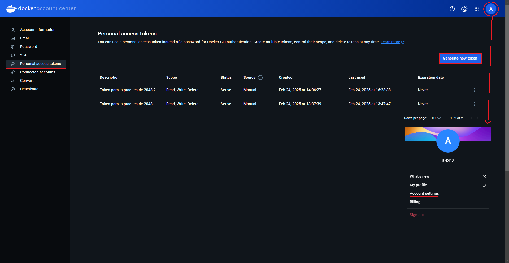
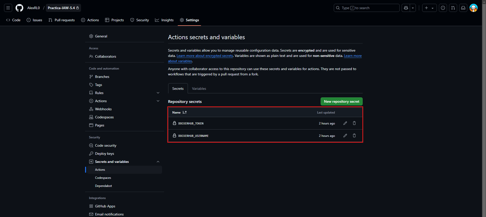

# Practica-IAW-MkDocks- Creación de un sitio web estático con MkDocs y GitHub Pages.

## 1. Crear un nuevo proyecto.

En primer tenemos que situarnos en el directorio donde queremos crear nuestro proyecto. En nuestro caso será el repositorio.

Para crear la estructura de archivos del MkDocs podemos hacer uso del comando new, como se muestra en el siguiente ejemplo.

```bash
docker run --rm -it -p 8000:8000 -u $(id -u):$(id -g) -v "$PWD":/docs squidfunk/mkdocs-material new .
```

El comando anterior creará el archivo de configuración mkdocs.yml y el archivo Markdown index.md dentro del directorio docs.

el flujo de archivos se verá tal que así:


## 2. Comando usado para crear un tag a la imagen ya montada

```bash
docker tag alexrl0/2048 alexrl0/2048:1.0
```


## 3. Comando para iniciar sesión en dockerhub

```bash
docker login -u alexrl0
```

> [!IMPORTANT]  
> Al iniciar sesión con este comando, nos pedirá una contraseña, en vez de poner una contraseña, tenemos que crear un token en dockerhub con permisos de lectura, escritura y ejecución y pegarlo para poder iniciar sesión.

vamos por pasos, lo primero es inicar sesión en dockerhub con la cuenta de github, una vez iniciada la sesión, le damos click a nuestro perfil y se nos desplegará una ventana flotante como aparece en la imagen señalado con una flecha, cuando estemos en esa ventana, le damos a `Accounts settings` y nos aparecerá lo que sale en la imagen. Una vez dentro, le damos a `Personal access tokens` y dentro, le damos a `create new token`.



---

Cuando le damos a crear el nuevo token, nos aparecerá una ventana como la que se ve en la imagen, nos pedirá un nombre para el token, una fecha de caducidad que en mi caso no le he puesto y lo último pero lo más importante los permisos de la misma, tenemos que ponerle de lectura, escritura y ejecución porque si no, docker no va a poder subir la imagen a dockerhub.


## 4. Archivo dockerfile que se va a ejecutar

```bash
FROM ubuntu:24.04

RUN apt update && \
  apt install nginx -y && \
  apt install git -y && \
  rm -rf /var/lib/apt/lists/*

RUN git clone https://github.com/josejuansanchez/2048.git /app && \
    mv /app/* /var/www/html/

EXPOSE 80

CMD ["nginx", "-g", "daemon off;"]
```

## 5. Archivo action de github que automatiza todo el proceso

```bash
name: Publish image to Docker Hub

# This workflow uses actions that are not certified by GitHub.
# They are provided by a third-party and are governed by
# separate terms of service, privacy policy, and support
# documentation.

on:
  push:
    branches: [ "main" ]
    # Publish semver tags as releases.
    tags: [ 'v*.*.*' ]
  workflow_dispatch:

env:
  # Use docker.io for Docker Hub if empty
  REGISTRY: docker.io
  # github.repository as <account>/<repo>
  #IMAGE_NAME: ${{ github.repository }}
  IMAGE_NAME: 2048
  IMAGE_TAG: latest

jobs:
  build:

    runs-on: ubuntu-latest
    permissions:
      contents: read
      packages: write

    steps:
      - name: Checkout repository
        uses: actions/checkout@v3

      # Set up BuildKit Docker container builder to be able to build
      # multi-platform images and export cache
      # https://github.com/docker/setup-buildx-action
      - name: Set up Docker Buildx
        uses: docker/setup-buildx-action@f95db51fddba0c2d1ec667646a06c2ce06100226 # v3.0.0

      # Login against a Docker registry except on PR
      # https://github.com/docker/login-action
      - name: Log into registry ${{ env.REGISTRY }}
        uses: docker/login-action@343f7c4344506bcbf9b4de18042ae17996df046d # v3.0.0
        with:
          registry: ${{ env.REGISTRY }}
          username: ${{ secrets.DOCKERHUB_USERNAME }}
          password: ${{ secrets.DOCKERHUB_TOKEN }}

      # This action can be used to check the content of the variables
      - name: Debug
        run: |
          echo "github.repository: ${{ github.repository }}"
          echo "env.REGISTRY: ${{ env.REGISTRY }}"
          echo "github.sha: ${{ github.sha }}"
          echo "env.IMAGE_NAME: ${{ env.IMAGE_NAME }}"

      # Build and push Docker image with Buildx (don't push on PR)
      # https://github.com/docker/build-push-action
      - name: Build and push Docker image
        id: build-and-push
        uses: docker/build-push-action@0565240e2d4ab88bba5387d719585280857ece09 # v5.0.0
        with:
          context: .
          push: ${{ github.event_name != 'pull_request' }}
          tags: ${{ env.REGISTRY }}/${{ secrets.DOCKERHUB_USERNAME }}/${{ env.IMAGE_NAME }}:${{ env.IMAGE_TAG }}
          cache-from: type=gha
          cache-to: type=gha,mode=max          
```

Este archivo de trabajo de GitHub Actions construye y publica una imagen Docker en DockerHub.

```yaml
name: Publish image to Docker Hub
```

## Eventos de Activación

El flujo de trabajo se activa con los siguientes eventos:

```yaml
on:
  push:
    branches: [ "main" ]
  tags: [ 'v*.*.*' ]
  workflow_dispatch:
```

## Variables de Entorno

Estas son las variables de entorno utilizadas en el flujo de trabajo:

```yaml
env:
  REGISTRY: docker.io
  IMAGE_NAME: 2048
  IMAGE_TAG: latest
```

## Jobs y Pasos

### Build Job

El trabajo `build` se ejecuta en un sistema `ubuntu-latest` con los siguientes pasos:

1. **Checkout del Repositorio**

    ```yaml
    - name: Checkout repository
      uses: actions/checkout@v3
    ```

2. **Configurar Docker Buildx**

    ```yaml
    - name: Set up Docker Buildx
      uses: docker/setup-buildx-action@v3.0.0
    ```

3. **Inicio de Sesión en el Registro Docker**

    ```yaml
    - name: Log into registry ${{ env.REGISTRY }}
      uses: docker/login-action@v3.0.0
      with:
        registry: ${{ env.REGISTRY }}
        username: ${{ secrets.DOCKERHUB_USERNAME }}
        password: ${{ secrets.DOCKERHUB_TOKEN }}
    ```
    Es necesario crear dos secrets en el repositorio de GitHub con los mismos nombres que aparecen en el archivo .yml: `DOCKERHUB_USERNAME` y `DOCKERHUB_TOKEN`, indicándole para el del usuario el de DockerHub y para el token, el token que creamos anteriormente en DockerHub.


4. **Paso de Depuración**

    ```yaml
    - name: Debug
      run: |
        echo "github.repository: ${{ github.repository }}"
        echo "env.REGISTRY: ${{ env.REGISTRY }}"
        echo "github.sha: ${{ github.sha }}"
        echo "env.IMAGE_NAME: ${{ env.IMAGE_NAME }}"
    ```

5. **Construir y Publicar la Imagen Docker**

    ```yaml
    - name: Build and push Docker image
      id: build-and-push
      uses: docker/build-push-action@v5.0.0
      with:
        context: .
        push: ${{ github.event_name != 'pull_request' }}
        tags: ${{ env.REGISTRY }}/${{ secrets.DOCKERHUB_USERNAME }}/${{ env.IMAGE_NAME }}:${{ env.IMAGE_TAG }}
        cache-from: type=gha
        cache-to: type=gha,mode=max
    ```

## 5. Comprobación de que se hace y se publica en DockerHub


## 6. Comprobación de que la aplicación se despliega y funciona correctamente

```bash
docker run -d -p 80:80 alexrl0/2048
```

