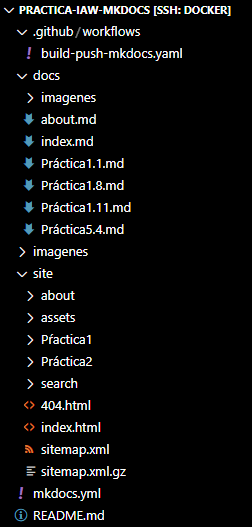

# Practica-IAW-MkDocks- Creación de un sitio web estático con MkDocs y GitHub Pages.

## 1. Crear un nuevo proyecto.

En primer tenemos que situarnos en el directorio donde queremos crear nuestro proyecto. En nuestro caso será el repositorio.

Para crear la estructura de archivos del MkDocs podemos hacer uso del comando new, como se muestra en el siguiente ejemplo.

```bash
docker run --rm -it -p 8000:8000 -u $(id -u):$(id -g) -v "$PWD":/docs squidfunk/mkdocs-material new .
```

Este comando creará el archivo de configuración mkdocs.yml y el archivo Markdown index.md dentro del directorio docs.

el flujo de archivos se verá tal que así:



## 2. Archivo de configuración mkdocs.yml por dentro

```bash
site_name: IAW

nav:
    - Principal: index.md
    - Acerca de: about.md
    - Práctica-1.1: Práctica1.1.md
    - Práctica-1.8: Práctica1.8.md
    - Práctica-1.11: Práctica1.11.md 
    - Práctica-5.4: Práctica5.4.md

theme: 
  name: material
  palette:
    primary: cyan
    accent: purple
```

## 3. Crear la  página web de manera desatendida

```bash
docker run --rm -it -u $(id -u):$(id -g) -v "$PWD":/docs squidfunk/mkdocs-material build
```

Este comando creará un directorio llamado site donde guarda el sitio web que se ha generado. En la imagen del comienzo, se puede ver como está la carpeta site.

## 4. Crear un workflow de CI/CD en GitHub Actions para pubicar un sitio web en GitHub Pages

Archivo `build-push-mkdocs.yaml` para la carpeta .github/workflows:

```bash
name: build-push-mkdocs

# Eventos que desescandenan el workflow
on:
  push:
    branches: ["main"]

  workflow_dispatch:

# A workflow run is made up of one or more jobs that can run sequentially or in parallel
jobs:

  # Job para crear la documentación de mkdocs
  build:
    # Indicamos que este job se ejecutará en una máquina virtual con la última versión de ubuntu
    runs-on: ubuntu-latest
    
    # Definimos los pasos de este job
    steps:
      - name: Clone repository
        uses: actions/checkout@v4

      - name: Install Python3
        uses: actions/setup-python@v4
        with:
          python-version: 3.x

      - name: Install Mkdocs
        run: |
          pip install mkdocs
          pip install mkdocs-material 

      - name: Build MkDocs
        run: |
          mkdocs build

      - name: Push the documentation in a branch
        uses: s0/git-publish-subdir-action@develop
        env:
          REPO: self
          BRANCH: gh-pages # The branch name where you want to push the assets
          FOLDER: site # The directory where your assets are generated
          GITHUB_TOKEN: ${{ secrets.GITHUB_TOKEN }} # GitHub will automatically add this - you don't need to bother getting a token
          MESSAGE: "Build: ({sha}) {msg}" # The commit message
```

## 5. Cambiar los permisos del workflow del repositorio

Para configurar el repositorio seleccionamos: Settings -> Actions -> General.

Hay que buscar la sección Workflow permissions y seleccionamos la opción Read and write permissions


## 5. Comprobación de que se hace y se publica la página correctamente


## 6. URL de la página web

