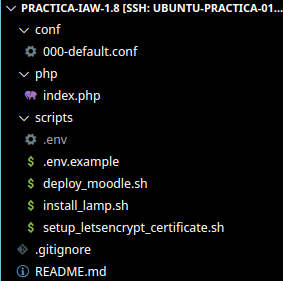
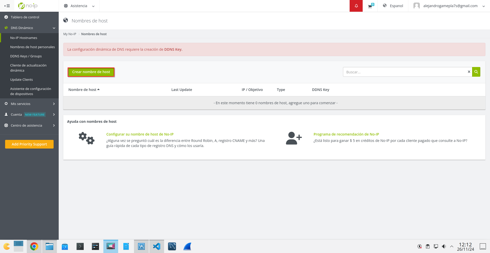
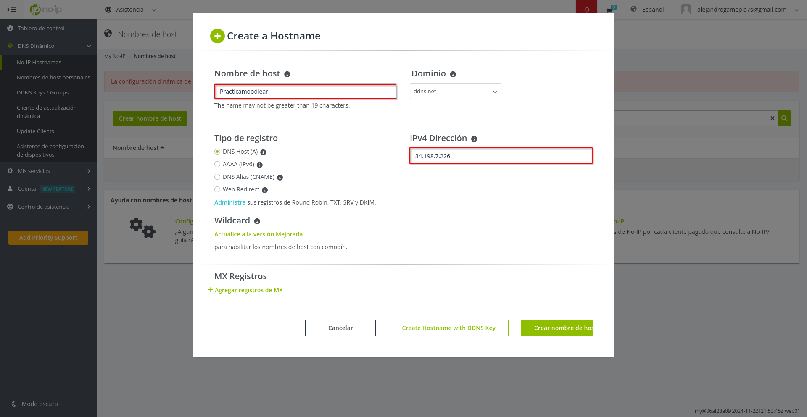
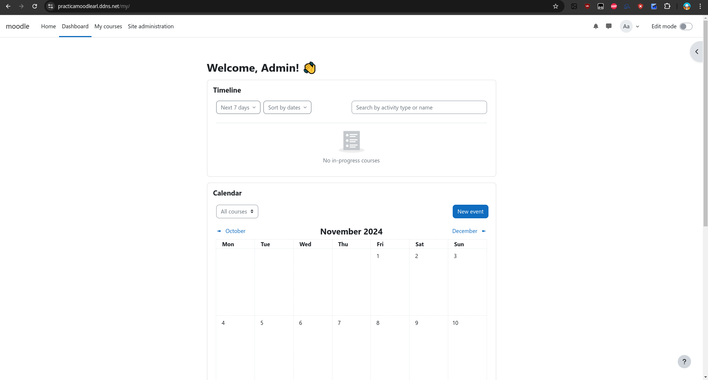

# Practica-IAW-1.8- Implantación de Moodle en Amazon Web Services (AWS)

## Pasos previos a la instalación

**para la instalación vamos a tener que crear la siguiente estructura de directorios y archivos:**



**Una vez creados los archivos y directorios, procedemos a la instalación de las herramientas.**

## Implantación de Moodle en Amazon Web Services (AWS)

## 1. Creamos un nombre de dominio para nuestro servidor con la web `no-ip`

### Paso 1. Crear el nombre del dominio 

Para crear el nombre de dominio en la página, tenemos que registrarnos y dirigirnos al sitio que muestra la captura y darle a **crear nombre de host**.



Una vez dado al recuadro de crear el nombre, nos sale un asistente para poner el nombre de host que queramos, el dominio que queremos que lleve, la dirección ip de la máquina o pc que queremos que tenga ese nombre de host y el tipo de registro que queremos que lleve, en nuestro caso es el **DNS Host A**



Hecho esto ya podemos automatizar la implantación de Moodle en Amazon Web Services (AWS)

## 2. Creación del archivo `deploy_moodle` para la implementación

### Paso 1. Importamos el archivo de variables y mostramos los comandos que se van ejecutando 

```bash
source .env
```

```bash
set -ex
```

### Paso 2. Eliminamos descargas previas de moodle

```bash
rm -rf /tmp/moodle*
```

> [!TIP]  
> Hacemos esto para evitar que haya duplicados dentro de ese directorio a la hora de descargarnos moodle.

### Paso 3. Eliminamos descargas previas de /var/www/html/*

```bash
rm -rf /var/www/html/*
```

### Paso 4. Descargamos el código fuente de Moodle

```bash
wget https://download.moodle.org/download.php/direct/stable405/moodle-latest-405.tgz -P /tmp
```

### Paso 5. Extraemos Moodle

```bash
tar -zxvf /tmp/moodle-latest-405.tgz -C /tmp
```

### Paso 6. Movemos Moodle al directorio deseado

```bash
mv /tmp/moodle $MOODLE_DIRECTORY
```

### Paso 7. Configuramos permisos para apache

```bash
chown -R www-data:www-data $MOODLE_DIRECTORY
chmod -R 755 $MOODLE_DIRECTORY
```

### Paso 8. Creamos la base de datos y el usuario para Moodle

```bash
mysql -u root <<< "DROP DATABASE IF EXISTS $MOODLE_DB_NAME"
mysql -u root <<< "CREATE DATABASE $MOODLE_DB_NAME DEFAULT CHARACTER SET utf8mb4 COLLATE utf8mb4_unicode_ci"
mysql -u root <<< "DROP USER IF EXISTS '$MOODLE_DB_USER'@'$IP_CLIENTE_MYSQL'"
mysql -u root <<< "CREATE USER '$MOODLE_DB_USER'@'$IP_CLIENTE_MYSQL' IDENTIFIED BY '$MOODLE_DB_PASSWORD'"
mysql -u root <<< "GRANT ALL PRIVILEGES ON $MOODLE_DB_NAME.* TO '$MOODLE_DB_USER'@'$IP_CLIENTE_MYSQL'"
mysql -u root <<< "FLUSH PRIVILEGES"
```

> [!IMPORTANT]  
> Las variables las cambiamos por las que tenemos en el archivo `.env` configuradas para que se cree todo correctamente.

### Paso 9. Creamos el archivo de configuración de moodle y lo configuramos

```bash
cp $MOODLE_DIRECTORY/config-dist.php $MOODLE_DIRECTORY/config.php
sed -i "s/'pgsql'/'${MOODLE_TYPE//\//\\/}'/g" $MOODLE_DIRECTORY/config.php 
sed -i "s/'localhost'/'${MOODLE_DB_HOST//\//\\/}'/g" $MOODLE_DIRECTORY/config.php 
sed -i "s/'moodle'/'${MOODLE_DB_NAME//\//\\/}'/g" $MOODLE_DIRECTORY/config.php 
sed -i "s/'username'/'${MOODLE_DB_USER//\//\\/}'/g" $MOODLE_DIRECTORY/config.php 
sed -i "s/'password'/'${MOODLE_DB_PASSWORD//\//\\/}'/g" $MOODLE_DIRECTORY/config.php 
sed -i "s|\$CFG->wwwroot.*|\$CFG->wwwroot = 'https://${MOODLE_DOMAIN//\//\\/}';|" $MOODLE_DIRECTORY/config.php
sed -i "s|\$CFG->dataroot.*|\$CFG->dataroot = '${MOODLE_DATA_DIRECTORY//\//\\/}';|" $MOODLE_DIRECTORY/config.php
sed -i "s/^max_input_vars.*/max_input_vars = 5000/" /etc/php/8.3/cli/php.ini
sed -i "s/^max_input_vars.*/max_input_vars = 5000/" /etc/php/8.3/apache2/php.ini
```

> [!IMPORTANT]  
> **Las variables** las cambiamos por las que tenemos en el archivo `.env` configuradas para que se cree todo correctamente. 
>> **Descripción de los comandos:** 
> - Cambia el tipo de base de datos usado por Moodle. 
> - Actualiza la dirección del servidor de la base de datos. 
> - Configura el nombre de la base de datos de Moodle. 
> - Establece el nombre de usuario para la base de datos. 
> - Define la contraseña para la base de datos. 
> - Actualiza la URL principal del sitio Moodle. 
> - Configura el directorio donde Moodle almacena sus datos. 
> - Ajusta el parámetro `max_input_vars` para PHP CLI. 
> - Ajusta el parámetro `max_input_vars` para PHP Apache.


### Paso 10. Creamos el directorio de datos de Moodle

```bash
mkdir -p $MOODLE_DATA_DIRECTORY
chown -R www-data:www-data $MOODLE_DATA_DIRECTORY
chmod -R 755 $MOODLE_DATA_DIRECTORY
```

### Paso 11. Reiniciamos apache

```bash
systemctl restart apache2
```

### Paso 12. Comprobación de que Moodle funciona

