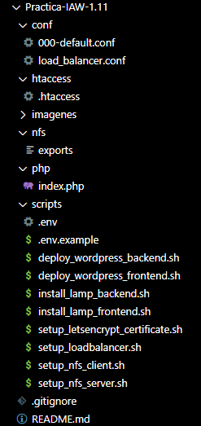
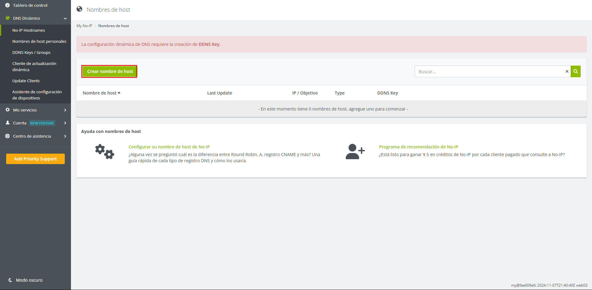
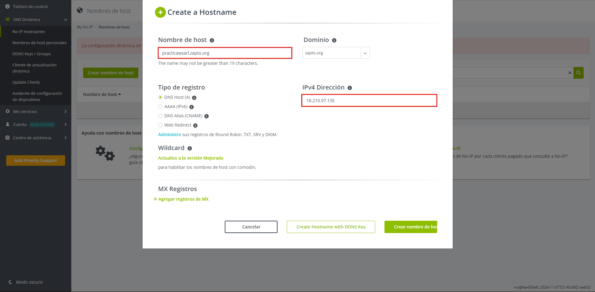
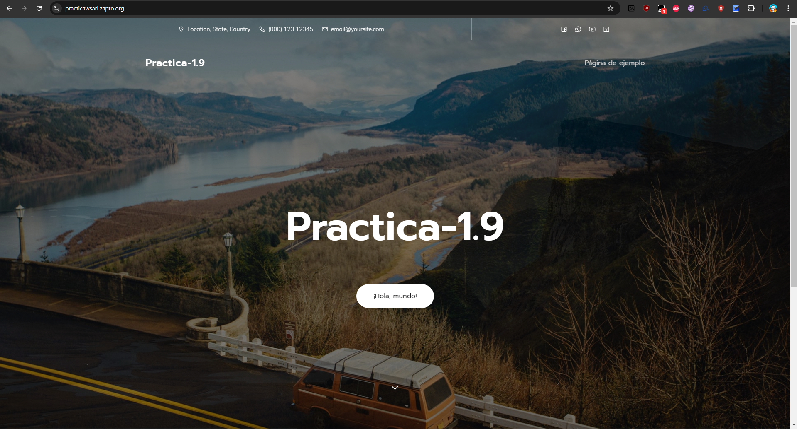
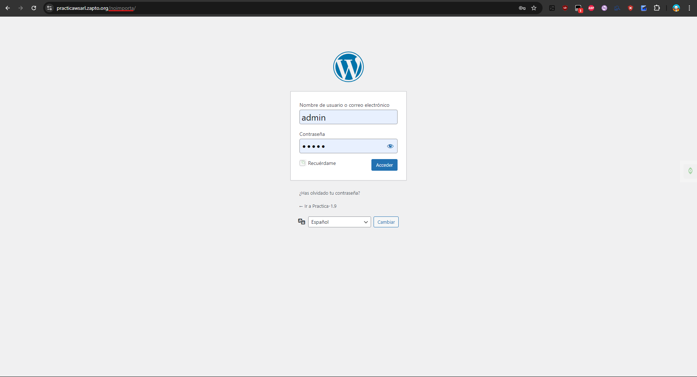
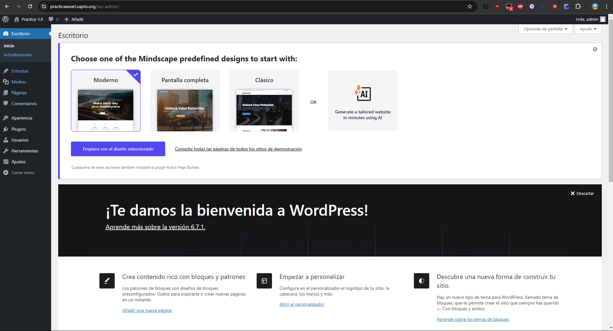

# Practica-IAW-1.11- Implantación de Wordpress en AWS utilizando una arquitectura de tres niveles

## Pasos previos a la instalación

**para la instalación vamos a tener que crear la siguiente estructura de directorios y archivos:**



**Una vez creados los archivos y directorios, procedemos a la implantación de Wordpress en AWS utilizando una arquitectura de tres niveles.**

## Implantación de Wordpress en AWS utilizando una arquitectura de tres niveles

## 1. Creamos un nombre de dominio para nuestro servidor con la web `no-ip`

### Paso 1. Crear el nombre del dominio 

Para crear el nombre de dominio en la página, tenemos que registrarnos y dirigirnos al sitio que muestra la captura y darle a **crear nombre de host**.



Una vez dado al recuadro de crear el nombre, nos sale un asistente para poner el nombre de host que queramos, el dominio que queremos que lleve, la dirección ip de la máquina o pc que queremos que tenga ese nombre de host y el tipo de registro que queremos que lleve, en nuestro caso es el **DNS Host A**



Hecho esto ya podemos automatizar el proceso de la implantación de Wordpress en AWS utilizando una arquitectura de tres niveles

## 1.1 Infraestructura necesaria

La infraestructura necesaria está compuesta de cuatro máquinas virtuales, una para el balanceador de carga (Load Balancer), dos como frontales web (Front-End) y una como servidor de base de datos MySQL (Back-End).

* Servidor NFS (Esta práctica, Práctica-IAW-1.11-NFS_server)
* Balanceador. (Práctica-IAW-1.10-LoadBalancer).
* Frontal Web 1/Cliente NFS. (Práctica-IAW-1.9-Frontend).
* Frontal Web 2/Cliente NFS. (Práctica-IAW-1.10-frontend2).
* Servidor de Base de Datos MySQL. (Práctica-IAW-1.9-Backend).

## 2. Creación del archivo `setup_nfs_server` para el servidor NFS

### Paso 1. Importamos el archivo de variables y mostramos los comandos que se van ejecutando 

```bash
source .env
```

```bash
set -ex
```

### Paso 2. Actualizamos los repositorios

```bash
apt update
```

### Paso 3. Actualizamos los paquetes

```bash
apt upgrade -y
```

### Paso 4. Instalamos el servidor NFS

```bash
apt install nfs-kernel-server -y
```

### Paso 5. hacemos el directorio

```bash
mkdir -p /var/www/html
```

### Paso 6. Modificamos el grupo y el propietario del directorio

```bash
chown nobody:nogroup /var/www/html
```

### Paso 7. copiamos la plantilla exports a /etc/exports

```bash
cp ../conf/load_balancer.conf /etc/nginx/sites-available
```

> [!IMPORTANT]  
> El archivo `exports` lo tenemos que hacer nosotros en la carpeta `conf` y moverlo al directorio de sitios disponibles de nginx para que lo vea y lo habilite para su funcionamiento. A continuación, pongo el contenido del fichero `exports`:
>```bash
>/var/www/html FRONTEND_NETWORK(rw,sync,no_root_squash,no_subtree_check)
>```

### Paso 8. Reemplazamos el valor de la plantilla de /etc/exports
```bash
sed -i "s#FRONTEND_NETWORK#$FRONTEND_NETWORK#" /etc/exports
```

> [!IMPORTANT]  
> Las variables que irán apareciendo durante los pasos están todas definidas en el archivo `.env` y en `.env.example` se pueden ver las variables que hay que tener definidas.

### Paso 9. Reiniciamos el servicio de NFS

```bash
systemctl restart nfs-kernel-server
```
---

## 3. Creación del archivo `setup_nfs_client` para los clientes NFS

### Paso 1. Importamos el archivo de variables y mostramos los comandos que se van ejecutando 

```bash
source .env
```

```bash
set -ex
```

### Paso 2. Actualizamos los repositorios

```bash
apt update
```

### Paso 3. Actualizamos los paquetes

```bash
apt upgrade -y
```

### Paso 4. Instalamos el cliente NFS

```bash
apt install nfs-common -y
```

### Paso 5. Montamos el directorio

```bash
mount $NFS_SERVER_IP:/var/www/html /var/www/html
```

### Paso 6. Cambiamos la variable de /etc/fstab

```bash
sed -i '$a\172.31.28.95:/var/www/html /var/www/html  nfs auto,nofail,noatime,nolock,intr,tcp,actimeo=1800 0 0' /etc/fstab
```

## Comprobación de que WordPress en la arquitectura de tres niveles funciona







Sale el nombre de la Práctica 1.9 porque no le he cambiado el nombre a la página.